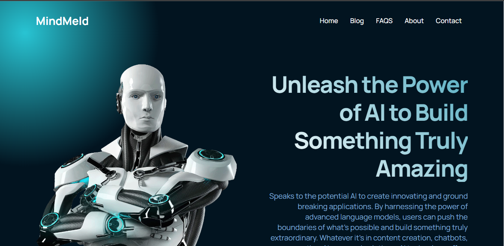

# -MindMeld-
 "MindMeld" is a (React App) website that is all about Artificial Intelligence (AI).
 

 Welcome to the repository for "MindMeld", your source for informative and engaging content on AI and technology. Our blog features a wide range of articles, from exploring the benefits of AI to examining the ethical implications of its use. Our goal is to provide a platform for thought-provoking discussions on the latest advancements in AI and its impact on society.

 Our website covers various topics related to AI, including machine learning, robotics, automation, natural language processing, deep learning, neural networks, computer vision, data analysis, predictive analytics, and the future of work. We also explore the practical applications of AI across various industries, such as finance, healthcare, retail, and more.

 Our team consists of passionate individuals with a deep understanding of AI and its capabilities. We strive to provide our readers with high-quality, accurate, and engaging content that will help them stay informed and up-to-date on the latest trends in the world of AI.

 Thank you for visiting our repository. We invite you to explore our blog and join the conversation on the future of AI and technology. 

 Check it out https://mindmeld.netlify.app/
